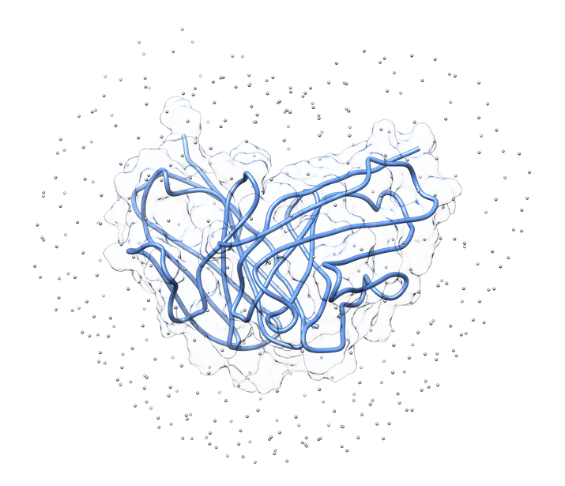

# Official Documentation

#### Table of Contents

- [Introduction](#1-introduction)
- [Setup a simulation](#2-setup-a-simulation)
- [Run a simulation](#3-run-a-simulation)
- [Generate models](#4-generate-models)
- [Clustering](#5-clustering)
- [Custom Scoring Functions](#6-custom-scoring-functions)

## 1. Introduction

### 1.1. What is LightDock?
LightDock is a protein-protein and protein-DNA docking protocol based on the [Glowworm Swarm Optimization](https://link.springer.com/article/10.1007/s11721-008-0021-5) (GSO) algorithm. The LightDock protocol has been published in Oxford Bioinformatics:

**LightDock: a new multi-scale approach to protein–protein docking** 
[Brian Jiménez-García](https://scholar.google.es/citations?user=eVN1WVYAAAAJ&hl=en), Jorge Roel-Touris, Miguel Romero-Durana, Miquel Vidal, Daniel Jiménez-González and Juan Fernández-Recio 
*Bioinformatics*, Volume 34, Issue 1, 1 January 2018, Pages 49–55, [https://doi.org/10.1093/bioinformatics/btx555](https://doi.org/10.1093/bioinformatics/btx555)

Specific details of the protocol can be found in the publication mentioned above, but in summary, LightDock is:

- *Ab initio* protocol, which means that only requires of the 3D coordinates of the protein partners for predicting the protein-protein or protein-DNA complex.

- Capable of modeling protein-protein and protein-DNA complexes in rigid-body fashion or modeling backbone flexibility using [Anisotropic Network Model](https://en.wikipedia.org/wiki/Anisotropic_Network_Model) (ANM). If ANM mode is activated, LightDock calculates the Ca-Ca ANM model using the awesome [ProDy](http://prody.csb.pitt.edu/) Python library. By default, the first 10 non-trivial normal modes are calculated for both receptor and ligand (in every residue backbone, extended to side-chains). See [Prody ANM documentation](http://prody.csb.pitt.edu/tutorials/enm_analysis/anm.html) for an example.

- Customizable by the user. LightDock is not only a protocol, but a framework for testing and developing custom scoring functions. The GSO optimization algorithm is agnostic of the force-field used, so in theory LightDock is capable of minimizing the docking energies in any force-field given by the user. See *Custom Scoring Functions* section for more details.

- Prepared to scale in [HPC](https://en.wikipedia.org/wiki/Supercomputer) architectures. LightDock nature is *embarrassingly parallel* as each swarm is treated as an independent simulation. This property makes LightDock to scale up to a number of CPU cores equal to the number of swarms simulated. Two implementations are given: 1) [multiprocessing](https://docs.python.org/2/library/multiprocessing.html) (by default) and 2) MPI (using [mpi4py](http://mpi4py.scipy.org/docs/) library).

- Capable of using multiple scoring functions during the minimization. Instead of specifiying a single scoring function, a file containing the weight and the name of the scoring function can be given as an input. LightDock will combine the different scoring functions as a linear combination of their value multiplied by the weight specified in the file.

### 1.2. Swarms
In LightDock, the receptor molecule is keep fixed (despite atoms positions can move if ANM mode is enabled). Over its surface, a set of points is calculated. Each of these points is a swarm center which represent an independent simulation. For example, for complex [1VFB](https://www.rcsb.org/structure/1VFB), 400 swarms are calculated:

For each of these swarm centers, a number *N* of glowworms, the algorithm agents, are disposed in a random way. Every glowworm represents a possible ligand conformation. In the following figure a set of 300 glowworms are displayed in a single swarm:

More in detail, each glowworm is represented as a 3D-axis object in its center of mass and oriented as the actual 3D-axis orientation:

## 2. Setup a simulation

TBC

## 3. Run a simulation

TBC

## 4. Generate models

TBC

## 5. Clustering

TBC

## 6. Custom Scoring Functions

TBC